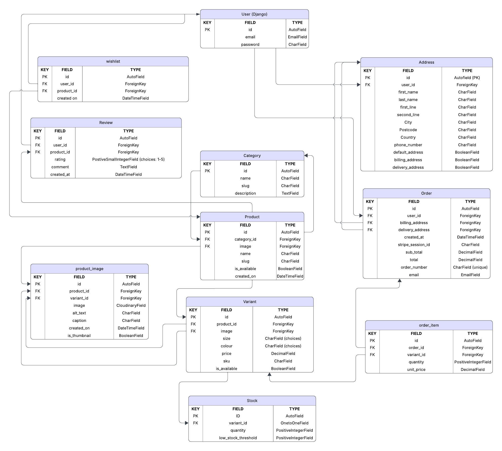
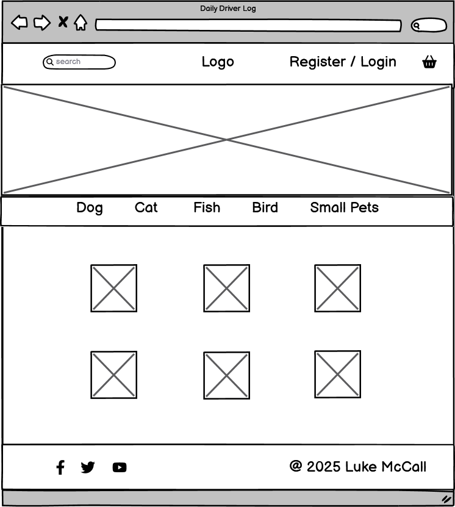

---

# *Happy Tails Pet Supplies*

---

## Contents

* [Project Overview](#project-overview)
* [User Stories](#user-stories)
* [Features](#features)
* [Planning and Design](#planning-and-design)
* [Agile Methodology](#agile-methodology)
* [Technologies Used](#technologies-used)
* [Deployment](#deployment)
* [Testing](#testing)
* [Future Features and Improvements](#future-features-and-improvements)
* [Credits](#credits)
---

## Project Overview
Happy Tails Pet Supplies is a full-stack e-commerce web application built with Django, designed to provide customers with a seamless online shopping experience for pet products.

The website allows users to:

- Browse a range of pet supplies across multiple categories

- View detailed product descriptions, images, and available variants (e.g., size or colour)

- Add items to their basket and complete purchases securely using Stripe payments

- Register for an account, manage personal details, and review past orders

Store administrators can:

- Add, edit, and manage products, categories, and stock levels directly through the admin dashboard

- Monitor customer orders and update order statuses

The project demonstrates key full-stack development concepts, including database-driven functionality, user authentication, and secure payment integration.
Development followed Agile principles, with user stories and MoSCoW prioritisation guiding feature implementation.

The focus throughout the project has been to create a realistic, functional, and user-friendly e-commerce platform that provides a smooth and secure shopping experience.

## User Stories

## Features

## Planning and Design

### Workflow Diagram
This diagram was created at the start of the project to outline planned structure.

Click here to view the initial workflow diagram.

### Entity Relationship Diagram

Click here to view the entity relationship diagram.

### Wireframes

Click each section to expand and view the wireframe for that page.

Home Page Wireframe

Register Page Wireframe

Login Page Wireframe

Basket Page Wireframe

Product Detail Wireframe

Account Dashboard Wireframe

## Agile Methodology

## Technologies Used

## Deployment

## Testing

## Future Features and Improvements

## Credits

* [Back To Top](#contents)