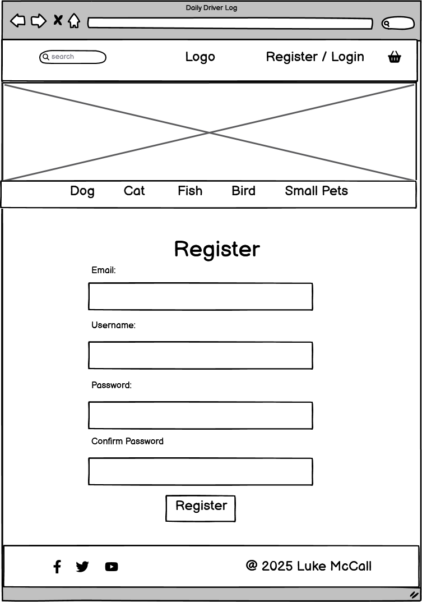
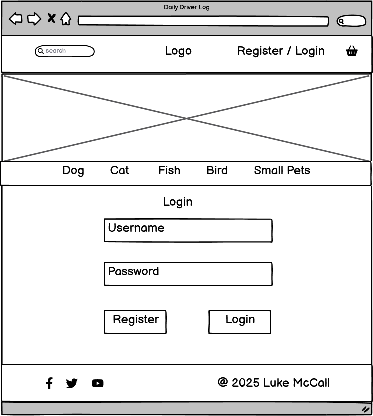
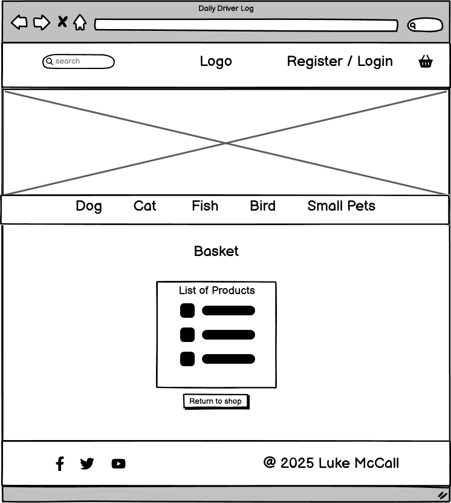
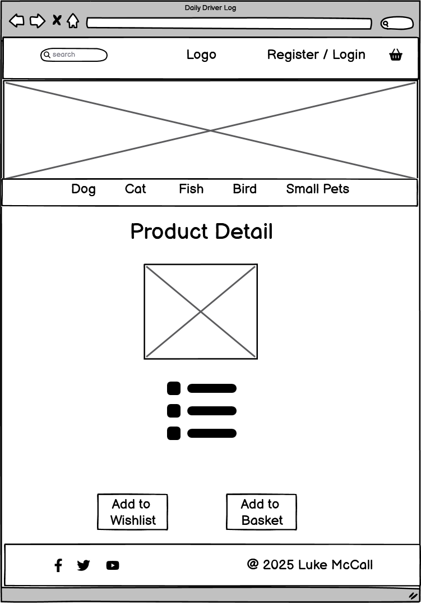
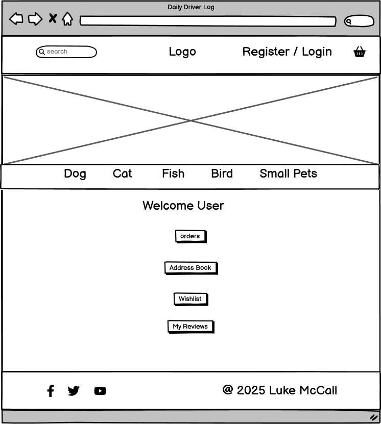

---

# *Happy Tails Pet Supplies*

The site can be accessed by this [link](https://happy-tails-00dc1c2811f5.herokuapp.com/)
---

## Contents

* [Project Overview](#project-overview)
* [User Stories](#user-stories)
* [Features](#features)
* [Planning and Design](#planning-and-design)
* [Agile Methodology](#agile-methodology)
* [Technologies Used](#technologies-used)
* [Deployment](#deployment)
* [Testing](#testing)
* [Future Features and Improvements](#future-features-and-improvements)
* [Credits](#credits)
---

## Project Overview
Happy Tails Pet Supplies is a full-stack e-commerce web application built with Django, designed to provide customers with a seamless online shopping experience for pet products.

The website allows users to:

- Browse a range of pet supplies across multiple categories

- View detailed product descriptions, images, and available variants (e.g., size or colour)

- Add items to their basket and complete purchases securely using Stripe payments

- Register for an account, manage personal details, and review past orders

Store administrators can:

- Add, edit, and manage products, categories, and stock levels directly through the admin dashboard

- Monitor customer orders and update order statuses

The project demonstrates key full-stack development concepts, including database-driven functionality, user authentication, and secure payment integration.
Development followed Agile principles, with user stories and MoSCoW prioritisation guiding feature implementation.

The focus throughout the project has been to create a realistic, functional, and user-friendly e-commerce platform that provides a smooth and secure shopping experience.

## User Stories

Below are the user stories organised by priority. Each story expands on click and includes a screenshot where applicable.

### Must Have

•   As a user, I want to browse products by category so that I can easily find what I’m looking for.

•	As a user, I want to search for products by name/keyword so that I can quickly locate a specific item.

•	As a user, I want to view product details (name, description, price, image) so that I can make an informed decision.

•	As a customer, I want to add products to my basket so that I can keep track of what I intend to buy.

•	As a customer, I can view and update my basket so that I can remove items before checkout.

•	As a customer, I want to register an account and log in so that I can save my details and view my order history.

•	As a customer, I want to checkout securely using Stripe so that I can pay online with confidence.

•	As a customer, I want to receive order confirmation so that I know my purchase went through.

---

### Should Have

•	As a customer, I want to save my delivery details so that I don’t have to re-enter them each time I order.

•	As a customer, I want to receive email confirmation of my order so that I have a receipt outside of the website.

•	As a returning customer, I want to view my past orders so that I can reorder items easily.

•	As a store owner, I want to manage products so that I can keep the store up to date.

•	As a store owner, I want to receive notifications of new orders so that I can fulfil them quickly.

---

### Could Have (Future Development)

•	As a customer, I want to leave reviews on products so that I can share my experience with others.

•	As a customer, I want to filter products (price, popularity, category) so that I can refine my shopping.

•	As a store owner, I want to view basic sales reports so that I can track performance.

•	As a customer, I want to add items to a Wishlist so that I can purchase them later.

•	As a customer, I want to customise pet supplies (e.g. engrave tags) so that I can personalise my order.

•	As a customer, I want to book grooming appointments online so that I can schedule services as well as products.

## Features

## Planning and Design

### Workflow Diagram
This diagram was created at the start of the project to outline planned structure.

Click here to view the initial workflow diagram.

### Entity Relationship Diagram

Click here to view the entity relationship diagram.

### Wireframes

Click each section to expand and view the wireframe for that page.

Home Page Wireframe

Register Page Wireframe

Login Page Wireframe

Basket Page Wireframe

Product Detail Wireframe

Account Dashboard Wireframe

## Agile Methodology

## Technologies Used

## Deployment

## Testing

## Future Features and Improvements

## Credits

* [Back To Top](#contents)